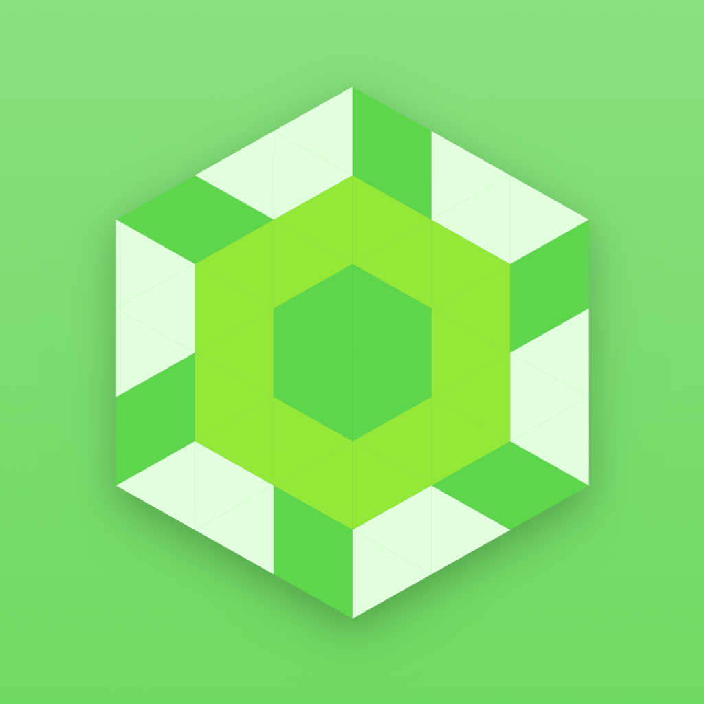





Septaday is an app that helps you live a healthier, more successful life by providing you with 7 static, daily tasks. If you reached this page via the links in the app, you can scroll around on this page to read about why each task is worth doing, with scientific research to back up each claim.

[View it on the App Store here](https://apps.apple.com/us/app/septaday/id1559559473).

## About me

To try and provide some credibility to myself... I am an [Ironman triathlete](https://www.ironman.com/), [professional software and app developer](https://resume.charlesmknox.com), [electronic musician](https://aperspection.com), and some other things - but most importantly, I try to live a balanced life.

If there's one thing I've learned so far, it's that life is mostly a matter of accomplishing routine tasks that will benefit us later, and whatever time remains is for you to fill with what makes you happy.

My goal is to share my experience and knowledge with the world through the Septaday app, and any other projects I create.

## Tasks

Septaday is about getting the routine, daily tasks of life done correctly, without having to really think about it. The app presents these tasks to you every day.

The tasks are sorted according to importance. Every task is essential, but some will offset others if not done correctly - for example, sleep is the highest on the list because it negatively affects everything else if not done correctly.

The remainder of this article will describe the scientific context for each task.

## ☑️ Consistent Sleep

From the app:

> "Consistent sleep has two parts: Get around 8 hours of sleep every night, and follow a consistent bed time and wake up time. 8 hours of sleep is generally recommended for optimal health, but this may vary slightly from person to person. Make it a priority to figure out how much sleep feels best for you by doing some experimentation over time - for some, 7.5 might be all that is needed, or less. It is very important to establish a very consistent sleep schedule - once you settle into a routine, you'll likely find yourself feeling better every day. Consistent sleep is the most important daily task, because without proper sleep, your immune system might be compromised or weakened, your brain may not be operating at maximum efficiency, your digestive system may not handle foods as well, you may feel more hungry, and a variety of other problems may occur."

This paragraph makes the following scientifically backed claims:

* Get around 7-8 hours of sleep every night
* Follow a consistent bed time and wake up time
* The amount of sleep time needed may vary from person

A lack of sleep can cause the following issues, and more:

  * Compromised or weakened immune system
  * Brain not operating at maximum efficiency
  * Digestive system not handling foods as well
  * Feeling more hungry
  * Other problems

Most of these claims can be verified by visiting this Healthline page, which includes references to studies for each claim: https://www.healthline.com/nutrition/10-reasons-why-good-sleep-is-important

### ⏰ Get around 7-8 hours of sleep every night

Study: Association of Usual Sleep Duration With Hypertension: The Sleep Heart Health Study

Study done in 2006, `n=5910`.

Conclusions:

> Usual sleep duration above or below the median of 7 to less than 8 hours per night is associated with an increased prevalence of hypertension, particularly at the extreme of less than 6 hours per night.

### 😦 Depression due to lack of sleep

Study: Work Hours, Sleep Sufficiency, and Prevalence of Depression Among Full-Time Employees: A Community-Based Cross-Sectional Study

Study done in 2002, `n=2643`

https://www.psychiatrist.com/jcp/depression/hours-sleep-sufficiency-prevalence-depression-among/

> Participants working > 10 hours per day, sleeping < 6 hours per day, and reporting insufficient sleep were, respectively, 37%, 43%, and 97% more likely to be depressed than those working 6 to 8 hours per day, sleeping 6 to < 8 hours per day, and reporting sufficient sleep (P < .05). Participants working > 10 hours per day or > 8 to 10 hours per day with < 6 hours per day of sleep showed a 41%-169% higher prevalence of depression versus those working 6 to 8 hours per day with 6+ hours per day of sleep (P < .05). Participants reporting insufficient sleep in 3 work-hour categories (6 to 8, > 8 to 10, and > 10 hours per day) showed a 62%-179% increase in the prevalence of depression versus those working 6 to 8 hours per day and reporting sufficient sleep (P < .05). No significant effects on depression were found for subjects in any work-hour category with 6+ hours of sleep or with subjective sufficient sleep.

Conclusions:

> Depression associated with long work hours is primarily a result of sleep deprivation. Greater attention should be paid to management of sleep deprivation to prevent workplace depression.

### 🥘 Feeling more hungry

This one is especially interesting, and something that most people may never notice. Losing sleep is likely to make you feel more hungry.

Study is locked behind a paywall, but luckily the abstract is viewable here: https://www.sciencedirect.com/science/article/abs/pii/S1389945708700133

> The increased risk of obesity is possibly linked to the effect of sleep loss on hormones that play a major role in the central control of appetite and energy expenditure, such as leptin and ghrelin. Reduced leptin and increased ghrelin levels correlate with increases in subjective hunger when individuals are sleep restricted rather than well rested. Given the evidence, sleep curtailment appears to be an important, yet modifiable, risk factor for the metabolic syndrome, diabetes and obesity.

### 🕰️ Consistent wake up and bed time

Publication: Circadian Rhythm Abnormalities

This is not a study, but rather an article leveraging existing cases and studies to present a summary of circadian rhythm (aka the natural body's daily cycle).

https://www.ncbi.nlm.nih.gov/pmc/articles/PMC3654533/

> Recent evidence strongly points to the ubiquitous influence of circadian timing in nearly all physiologic functions. Thus, in addition to the prominent sleep and wake disturbances, circadian rhythm disorders are associated with cognitive impairment, mood disturbances, and increased risk of cardiometabolic disorders. The recent availability of biomarkers of circadian timing in clinical practice has improved our ability to identify and treat these CRSDs.

Key points:

> The most common symptoms of these disorders are difficulties with sleep onset and/or sleep maintenance and excessive sleepiness that are associated with impaired social and occupational functioning. Effective treatment for most of the CRSDs requires a multimodal approach to accelerate circadian realignment with timed exposure to light, avoidance of bright light at inappropriate times, and adherence to scheduled sleep and wake times.

## ☑️ Eat Healthy

From the app:

> "Establishing a proper diet is critical, and there are two main components: hydration, and balanced dietary intake of nutritious foods. For hydration, always have a portable water bottle on you at all times (32oz or more), and any time you feel thirsty, drink up. For diet, there are tools online that will help you figure out your Basal Metabolic Rate, which helps you understand the number of calories your body is estimated to burn every day. The Cronometer app will also guide you in figuring out proper nutrient and vitamin balances in more detail than apps such as MyFitnessPal. Your goal is to eat only what you need to eat every day - If you eat too much or too little, there will probably be negative effects, such as weight gain, high blood pressure, fatigue, or other side effects."

### 🚰  Hydration

Hydration should be obvious, but there are mechanisms to hydration that you should understand. This article provides an _extremely_ comprehensive overview on the absolutely essential role of hydration, and some of the more nuanced questions you may have wondered for many years may be answered. Here's the link:

https://academic.oup.com/nutritionreviews/article/68/8/439/1841926

Here are some key takeaways:

> During exercise, individuals may not hydrate adequately when allowed to drink according to thirst. After periods of physical exertion, voluntary fluid intake may be inadequate to offset fluid deficits. Thus, mild-to-moderate dehydration can persist for some hours after the conclusion of physical activity.

> During exercise, children may be at greater risk for voluntary dehydration. Children may not recognize the need to replace lost fluids, and both children as well as coaches need specific guidelines for fluid intake.

> **Mild levels of dehydration can produce disruptions in mood and cognitive functioning.** Mild dehydration produces alterations in a number of important aspects of cognitive function such as concentration, alertness, and short-term memory [...] As with physical functioning, mild-to-moderate levels of dehydration can impair performance on tasks such as short-term memory, perceptual discrimination, arithmetic ability, visuomotor tracking, and psychomotor skills.

How much water should you drink? The article also attempts to take a scientific approach to answering that - this is a copy of Table 5 from the article - I added fluid ounces and gallons units to the rightmost columns to help add perspective:

| Age group (y) | Kcal/d estimated energy requirement | Al for fluid intake (mL/d) | Ratio AI mL/d: EER Kcal/d | Fluid Ounces/d (fl. oz/d) | Gallons/d |
| ------------- | ----------------------------------- | -------------------------- | ------------------------- | ------------------------- | --------- |
| Children 2–3  | 1000–1400                           | 1300                       | 0.93                      | 45.75                     | 0.34      |
| Female        |                                     |                            |                           |                           |           |
| 4–8           | 1400–1600                           | 1700                       | 1.06                      | 59.83                     | 0.45      |
| 9–13          | 1600–2000                           | 2100                       | 1.05                      | 73.91                     | 0.55      |
| 14–18         | 2000                                | 2300                       | 1.15                      | 80.95                     | 0.61      |
| 19–30         | 2000–2200                           | 2700                       | 1.23                      | 95.03                     | 0.71      |
| 31–50         | 2000                                | 2700                       | 1.35                      | 95.03                     | 0.71      |
| 50+           | 1800                                | 2700                       | 1.5                       | 95.03                     | 0.71      |
| Male          |                                     |                            |                           |                           |           |
| 4–8           | 1400–1600                           | 1700                       | 1.06                      | 59.83                     | 0.45      |
| 9–13          | 1800–2000                           | 2400                       | 1.20                      | 84.47                     | 0.63      |
| 14–18         | 2400–2800                           | 3300                       | 1.18                      | 116.14                    | 0.87      |
| 19–30         | 2600–2800                           | 3700                       | 1.32                      | 130.22                    | 0.98      |
| 31–50         | 2400–2600                           | 3700                       | 1.42                      | 130.22                    | 0.98      |
| 50+           | 2200–2400                           | 3700                       | 1.54                      | 130.22                    | 0.98      |

How do you interpret this table?

* **Kcal/d estimated energy requirement** - The number of calories you eat per day.
* **Al for fluid intake (mL/d)** - The number of milliliters of water you should drink per day.
* **Ratio AI mL/d: EER Kcal/d** - The ratio of calories-per-day to mL-per-day.
* **Fluid Ounces/d (fl. oz/d)** - The number of fluid ounces of water you should drink per day.
* **Gallons/d** - The number of gallons of water you should drink per day.

As you can see, depending on your dietary intake, **you may need to be drinking up to a gallon of day for proper hydration**.

### 🥑 Diet

Aside from staying hydrated, the amount and type of food you eat is essential. Diet is an ever changing subject, and it's difficult to really summarize the entire subject quickly - but in short, the method you should employ to determine how much to eat is as follows:

1. **Determine your Basal Metabolic Rate (BMR).** This number determines how many calories you should eat each day (assuming no exercise). Fill out the form below or use [this website](https://www.calculator.net/bmr-calculator.html):


<iframe src="https://www.mealpro.net/bmr/?color=232323" frameborder="0" width="100%" height="480" style="max-width: 100%"></iframe>


2. Based on the above number, use the [Cronometer app](https://cronometer.com/) - start by just entering 1 day's worth of food that you would normally eat into the app. **Just simply doing this will tell you how far off you are from meeting the standard, recommended nutrient intake goals.**

As a general recommendation, eat mostly vegetable or plant-based foods, as they are loaded with a lot of the nutrients you need. Additionally, expect to spend a few weeks fine-tuning your Cronometer-based diet.

## ☑️ Brush, Floss, Stay Clean

> "Floss. Brush teeth twice a day. Shower daily, wash your hands often, and stay clean. Flossing is the hardest habit to pick up for most people. I recommend using Listerine Reach flossers, and I regularly floss while going on a walk or some other routine task. Ask your dentist how to properly floss, and be honest with them - they're here to support you. Brushing once every 12 hours helps prevent bacteria buildup on your teeth."

### 🦷 Flossing

Ask your dentist why flossing is important. Simply put, brushing your teeth twice a day will not remove the bacteria from between your teeth.

One of the primary reasons to floss is to avoid [periodontal disease](https://www.nidcr.nih.gov/health-info/gum-disease/more-info). This is when the gums recede to avoid bacteria that is festering between your teeth when you do not floss or properly treat your teeth for long periods of time.

The hardest part about flossing is forming the habit - luckily, there is some science out there addressing exactly that:

https://bpspsychub.onlinelibrary.wiley.com/doi/full/10.1111/j.2044-8287.2012.02086.x

> Habit formation has been proposed as a means to promote maintenance of healthy behaviours, but there have been few investigations into how habits are formed. This exploratory study sought to model determinants of the formation of a dental flossing habit, including placement of the behaviour within the routine (before vs. after tooth‐brushing), past behaviour, prospective memory ability, and motivational factors.

> Participants with stronger prospective memory ability, higher levels of past behaviour, and a more positive attitude flossed more frequently during the study. Stronger automaticity was predicted by positive attitudes, and increased behaviour frequency during and prior to the study. Those who flossed after brushing (rather than before) tended to form stronger flossing habits and, at 8‐month follow‐up, had stronger habits and flossed more frequently.



From a habit-forming standpoint, I personally find it most beneficial to keep Listerine Reach Mint flossers nearby my desk, so that by the time the evening rolls around and I'm on the computer, I can just reach over and start flossing. I also keep a Reach floss package in my car at all times so that if I am on the go, I can floss - use care while driving always 🙂. Another habit-forming recommendation is to combine flossing with [walking](#-disconnect); bring your flosser with you while you walk!

### 🪥 Brushing your teeth

You should brush your teeth [twice a day](https://www.mayoclinic.org/healthy-lifestyle/adult-health/expert-answers/brushing-your-teeth/faq-20058193), and in general, try not go more than 12 hours without brushing, as bacteria will build up. This is actually a measurable phenomenon - if you brush your teeth in the morning, the smell of your breath will probably not be as good later in the evening. These studies mention this:

* https://europepmc.org/article/med/10825862
* https://www.hindawi.com/journals/ijd/2011/806258/

## ☑️ Exercise

> "Keep your heart rate within the 70%-85% heart rate zone for around 30 minutes, 5-7 days a week is recommended. Note that it's important to take at least 1-2 rest days per week if you are doing the same exercise too many days in a row (such as running). Your heart rate must be elevated into a specific heart rate zone in order for your effort to qualify as exercise; this is not the same as going on a leisurely walk. Searching for 'heart rate zones' should yield information about what your specific heart rates are with respect to your age."

Failing to exercise, long-term, is [comparable to smoking](https://www.tandfonline.com/doi/abs/10.1080/026404198366678) ([PDF](https://www.tandfonline.com/doi/pdf/10.1080/026404198366678)):

> [...] a prospective study of 25,341 men and 7080 women. These individuals completed a health screening examination and were followed for more than 8 years for mortality. Low cardiorespiratory fitness was one of the strongest predictors of mortality in this study, with the risk of low fitness being comparable to smoking.

[This article from Healthline](https://www.healthline.com/health-news/30-minutes-of-physical-activity-can-counteract-a-day-of-sitting) provides citations to make the following claims:

* Just 30 minutes of physical activity a day can counteract a day of sitting.
* Physical activity is linked to a longer life.
* Prolonged sitting is dangerous to your health.

### 💜 Heart rate

In order to reap the maximum benefits of exercise, I recommend getting [Strava](https://strava.com) and a Bluetooth heart rate monitor - I have had success with Garmin brands. During your exercise, keep your heart rate in the 70-85% zone, as this is (from my experience) the best way to improve cardio health without pushing yourself too hard on a daily basis:



### ⌛️ Time-efficient exercise

If you're a busy person, you probably want to know how to get the most benefit while spending the _least_ amount of time exercising. A "MET" measures this - it stands for [Metabolic equivalent of task](https://en.wikipedia.org/wiki/Metabolic_equivalent_of_task). For all intents and purposes, it is a number (typically around 1-15, measured in Watts/kg) that is a score of how much energy you'll burn for a given exercise - see the following table, which is taken directly from [this Wikipedia page](https://en.wikipedia.org/wiki/Metabolic_equivalent_of_task#Activities):

|                        Physical activity                        |   MET    |
| :-------------------------------------------------------------: | :------: |
|                   Light intensity activities                    |   < 3    |
|               writing, desk work, using computer                |   1.5    |
|                         walking slowly                          |   2.0    |
|                  Moderate intensity activities                  |  3 to 6  |
|                   walking, 3.0 mph (4.8 km/h)                   |   3.0    |
|          sweeping or mopping floors, vacuuming carpets          | 3 to 3.5 |
|             yoga session with asanas and pranayama              |   3.3    |
|                         Tennis doubles                          |   5.0    |
|                    sexual activity, aged 22                     |   5.8    |
|                  Vigorous intensity activities                  |    ≥6    |
|                 aerobic dancing, medium effort                  |   6.0    |
|    bicycling, on flat, 10–12 mph (16–19 km/h), light effort     |   6.0    |
|                          jumping jacks                          |   >6.0   |
| sun salutation (Surya Namaskar, vigorous with transition jumps) |   7.4    |
|                         basketball game                         |   8.0    |
|                   swimming moderately to hard                   | 8 to 11  |
|                   jogging, 5.6 mph (9.0 km/h)                   |   8.8    |
|                      rope jumping (66/min)                      |   9.8    |
|                      rope jumping (84/min)                      |   10.5   |
|                     rope jumping (100/min)                      |   11.0   |
|                  jogging, 6.8 mph (10.9 km/h)                   |   11.2   |

So, for best results, 30 minutes of jogging is the most efficient way to go.

### 🏃 My advice for new runners

For new runners, ease into it - it took me a few weeks of ramping up to actually get into running.

My personal belief (I have not researched this currently) is that jogging, running, and sprinting form should have you landing on the ball of your feet (the front). I see many people landing on their heels when they run; I do not recommend this because I believe it leads to injury more often. When you land on the ball of your foot, the impact is directed into the calf muscle directly, which differs greatly from those who land on their heels, in which the impact is absorbed in the bone structure of your leg (knees, hips especially). I want to be clear, I am not making a scientific claim in this statement. It may be true, I simply have not researched it at this time.

If you take my suggestion to run on the balls of your feet, and you're new to running or have traditionally run using your heels, your first couple runs will leave your calf muscles _extremely_ sore. Expect to take a few days between your first couple runs in this position. Eventually, you'll be able to run a marathon on the balls of your feet and it won't be a problem anymore. 🙂

I personally do not buy full running shoes any more either; because I am a forefoot runner, I use [minimalist shoes that are only $35 or so](https://www.amazon.com/gp/product/B07Y3XG878/). If you decide to go this route, please make sure to train into them. I started by using socks on a treadmill for 10 minutes, then 20, then 30 minutes until I built up my forefoot strength.

Good luck!

## ☑️ Disconnect

> "Disconnect from everything for 30 minutes. This can be done by taking a walk, meditating, lying down, sitting on the patio, showering, etc. A walk is a great choice - you can multi-task by flossing and walking, or talking with someone while walking together, for example. We typically have to be very focused on specific tasks, and our brains are operating in a different mode than when we are bored, or showering, or walking, for example. Being bored and letting the mind wander is actually more beneficial than staying focused for hours straight, because the brain is switching into a mode where it processes ideas in the background. This is why we often come up with 'shower thoughts' and other ideas when doing unrelated things. Take advantage of this by disconnecting!"

[Healthline has a great article on why taking a walk is beneficial](https://www.healthline.com/health/benefits-of-walking). Health benefits aside, the disconnection time from the usual daily activities provides a boost in creative thinking: https://psycnet.apa.org/record/2014-14435-001

> Walking outside produced the most novel and highest quality analogies. The effects of outdoor stimulation and walking were separable. Walking opens up the free flow of ideas, and it is a simple and robust solution to the goals of increasing creativity and increasing physical activity.

Additionally, I [wrote an article summarizing different brain modes](/health/general/learning-how-to-learn/#brain-modes); going for a walk triggers the "diffuse" mode of thinking.

## ☑️ Hour of Focus

> "In order to be successful, you have to get things done. That's why this task exists. Every day you should make it a priority to focus on something for one hour straight. Your ability to focus is like a muscle; you may have to train into it. Success will come with focus."

Everyone is different. Some people really struggle to focus. Others are able to focus for many hours at a time.

I have found that intentionally choosing one thing to focus on for an hour a day yields successful results in whatever you're trying to do. Being deliberate and setting this simple goal is a behavioral challenge for some. Try to dedicate your daily hour of focus to something that "future you" will thank you for.

## ☑️ Connect

> "Talk to someone, even for a small amount of time, every day. Making an impact on another person's life will have a positive impact on your life too. We often underestimate how much others will appreciate a simple hello, even if they don't have time to respond to you amidst their busy lives. If you do not speak to anyone for a long period of time, you may unconsciously be a bit less happy without even realizing it. Don't overdo it either; seek to converse with others at your own pace."

There are many scientific articles that support the claims in this task. This article provides an overview of 78 different publications in one:

https://www.sciencedirect.com/science/article/pii/S1364661309001478

> Social species, from *Drosophila melanogaster* to *Homo sapiens*, fare poorly when isolated. *Homo sapiens*, an irrepressibly meaning-making species, are, in normal circumstances, dramatically affected by perceived social isolation.

> Research indicates that perceived social isolation (i.e. loneliness) is a risk factor for, and may contribute to, poorer overall cognitive performance, faster cognitive decline, poorer executive functioning, increased negativity and depressive cognition, heightened sensitivity to social threats, a confirmatory bias in social cognition that is self-protective and paradoxically self-defeating, heightened anthropomorphism and contagion that threatens social cohesion.

I'll say something I've said before: Everyone is different. Some people crave human interaction far more than others. Take this one at your own pace, and if needed, treat it as a "pulse check", encouraging you to introspect and reflect on whether or not you are actually feeling any loneliness or isolation. You may not always be aware of it.

## App info

I worked hard to ensure that the app has a fairly seamless flow - my hope is that there are no bugs or usability issues with the app, but there are always things that may not work correctly. This section contains more information specific to the app.

### Data privacy

This app does not push any data **anywhere**, period. The only time data from this app can leave your phone is if you manually [export the data](#exporting-data) elsewhere. I do not collect (or want to deal with collecting) any of your data.

### Exporting data

To export your data as an `sqlite` file, you can go to About -> (scroll down) -> Export all data. It will allow you to share the database to any sharing target you want. Use this to backup your data or export it to another device.

### Importing data

Data must be imported to the device and accessible via the native file browser. Using the document picker, find a proper `sqlite` database to import, and once the import is performed, you will have to restart the app. **If you do not restart the app, things will not work correctly and you may have to re-import.**

### Roadmap

This app is meant to be simple with a lean feature set. I want to implement a few extra features in the future:

* **Daily push notification reminders** - It's a work in progress. I've reserved a section in the About screen for managing push notifications already. Once this is implemented, you will be able to configure what time of day you want a push notification on your phone to appear, which will remind you to get tasks done.

### Source code

The source code for this app is publicly viewable on my GitHub page, [here](https://github.com/charles-m-knox/septaday).
