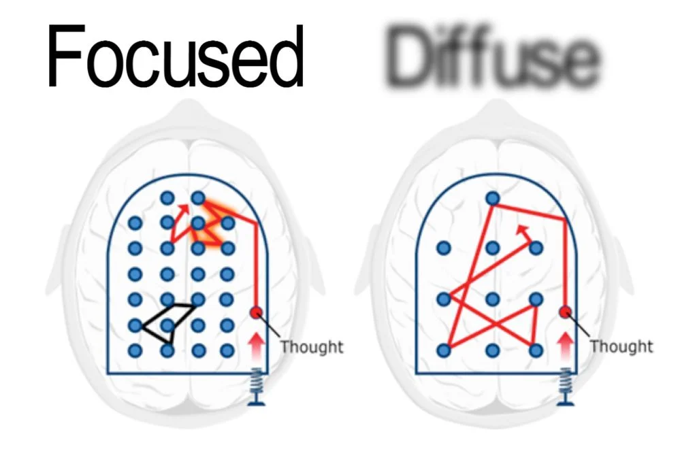
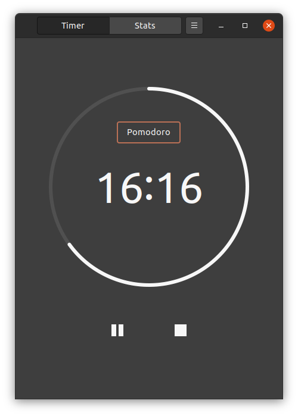
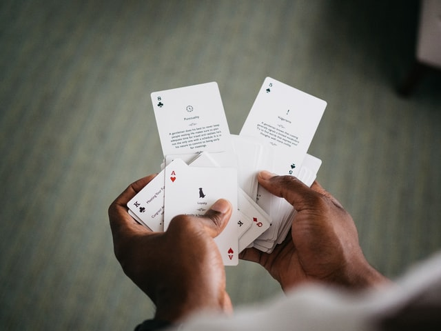

I've been taking the time regularly in my life to prioritize learning. I've been on the lookout for new things to learn.

So, I explored options for online learning. I found [Coursera](https://www.coursera.org). A few of the top recommended online classes included a particularly interesting class called [Learning How to Learn](https://www.coursera.org/learn/learning-how-to-learn/home/info).

In this class, you really do learn _how_ to properly learn and engage with new and confusing content. Let's take a look at some of the most profound things I learned from the class.

## Brain Modes

The first thing that caught my attention was the concept **diffuse** and **focused** brain modes.

<small>From Learning How to Learn Course Content</small>

Think about what it's like when you try to understand a difficult and novel concept, such as an abstract math or physics equation. When taking a fresh, new look at hard material like this, I tend to read back and forth, hoping to latch on to any piece of the material, and form associations with other pieces of the material that I'm trying to learn. During this process, I'm confused, uncertain of the topic, and generally not having a good time understanding what's going on.

It turns out that this is actually a typical brain mode, called the **diffuse** mode. Existing in the diffuse mode means that you're trying desperately to grab on to any novel concept you can and form new neural connections. This is where creative ideas and abstract concepts come to fruition. You **want** to remain in the diffuse mode so that you can encourage the inception of novel thoughts.

The downside about the diffuse brain mode is that it's _hard_ to remain in this mode for long - it's frustrating, confusing, and downright unsustainable to effectively always learn in this way. We all eventually reach a point where we just can't learn anymore, and the mind's ability to learn has reached a saturation point that will no longer allow more novel thoughts to form.

This is where the **focused** mode comes into play. When you're performing a routine task, or doing something easy and sensible, you're switched into the focused mode. In this mode, I personally choose to lift some weights, eat a few bites, have some quick chats, etc. This is a procedural, straightforward mode that is meant to sharply contrast the more difficult and abstract diffuse mode.

## Salvador Dali

Salvador Dali and Thomas Edison used a trick to enable diffuse mode thoughts on demand. They would hold something in their hand that makes a loud noise when dropped, such as keys or ball bearings, and hold them in their hands while drifting off into a brief nap. As soon as the nap takes over and muscle control is lost, the item in their hands would drop to the floor, and they would snap out of it.

The thoughts that were floating around in their diffuse brain are likely novel ideas and thoughts that they wouldn't have come to otherwise.

## The Technique

When you switch between focused and diffuse modes intentionally, your brain will actually form new neural pathways more efficiently.

**Stay diffuse for a while, then take a quick break in focused mode**. There is a technique that implements this: The **Pomodoro technique**.

**The concept is simple: Learn for 25 minutes, take a break for 5 minutes.**

During your learning time, don't break your focus. Just commit to learning for 25 minutes.

Then, when break time comes, do something easy. Perhaps you could frame it as a reward for all of your hard work. As I said earlier, I personally use the time to lift some weights, eat some bites of food, use the restroom, grab water, say hello to my significant other, etc.

## Pomodoro Software

I use Ubuntu 20.04 as my main system, so I'll recommend the [Gnome Pomodoro](https://gnomepomodoro.org/) software project.

<small>Gnome Pomodoro in action on my system</small>

Install it using its recommended installation method, and use the `gnome-tweak-tool` or the official Extensions application (built in to newer Gnome desktop versions) to ensure it's enabled. You can start it as a standalone application as well.

## Process vs Product

By focusing on process instead of product, it allows you to naturally work towards a goal instead of getting stressed about the end result. For example, following a process of spending 25 minutes on a task is more likely to succeed than trying to get the whole task done within 25 minutes. This principle operates complementary to the Pomodoro technique.

## Sleep

Scientific observations presented in the course confirm that there are actually small "toxic" substances that build up in the brain throughout the day. When the mind is at rest, natural processes wash away the undesirable substances. A healthy amount of sleep is necessary to refresh the mind.

I wish I could be more scientifically specific than this, but the class did not offer more insights - there are references presented that detailed more info, but I do not have the time to go into them in more detail.

## Working Memory and Long Term Memory

When we are focusing our minds on a task, we generally only are able to keep **4 things** in what's called "working memory". For example, when doing a math problem, you may only be able to keep track of a few variables and their values while working through the problem at a time.

Long term memory, on the other hand, can complement your working memory by helping you recall concepts related to an item in working memory.

To keep working memory and long term memory at their best, use techniques like **deliberate practice**.

## Deliberate Practice

Spreading out your learning by deliberately practicing a few problems regularly (for example once a day, or every couple days) helps facilitate absorption of the content and better understanding. This is one of the more important concepts to bake into your learning routine.

## Chunking

Chunks are pieces of information that are bound together through use and meaning. They're built with focused, undivided attention and understanding of the basic idea at hand. Chunks are critically important to learning because they allow you to form a solid block of related information that you can access quickly. The brain is quickly capable of recalling and leveraging a well-formed chunk.

The true advantage of using chunks comes to fruition when they can be used with other information, through a process called **transfer**.

## Transfer

Piggy-backing on the concept of **chunking**, **transfer** is the idea that a chunk can be *interleaved* with other areas of your mind (either via diffuse or focused modes of thinking!). This is **really important** because historically, clever people taking a chunk from one area of study in another field has lead to great innovations that might not otherwise have occurred.

## Illusions of Competence

When attempting to learn a new subject, it's important to acknowledge that there are certain learning methods that we try that do not actually yield any results. Proven, effective methods need to be discussed.

The first of these methods is to **test yourself** on the topics you're trying to learn. You can read all of the solutions you want, and re-read all of the text you want, but ultimately you're taking an easier path than if you had just tested yourself.

The next is **recall**. Highlighting, underlining, and re-reading are not effective learning methods. Recall is very effective, and it's easy. Simply look away from the text you just read, and try to recall it immediately from memory. If you fail, go over it again, and try it again until it sticks.

**Make mistakes** when learning. Don't be afraid to mess up. This is one of my personal appreciation points with a system like Coursera - you can frequently try again without penalty on most assignments, aside from, say, only being able to submit an assignment once every X hours.

Recall the segment on **deliberate practice** - practice makes perfect, and this applies to your learning. Set up practice problems for yourself regularly.

**Einstellung** is a German word for "mindset". An initial thought, pattern, or idea that already exists in your mind may prevent you from learning new things. Simply being made aware of the fact that you may be succumbing to *einstellung* in your studies can help you learn more effectively.

The last note for this section is about **The Law of Serendipity**. Lady Luck favors the one who tries. In practice, what this means is that if you just *try* to learn, regardless of what result you think you'll get, you're already more likely to succeed than the version of you that didn't try.

## Procrastination

Using the techniques outlined in the Pomodoro technique, and the process vs product discussion, procrastination should become less of a beast. That being said, there are still a couple ways to beat it still.

**Commit yourself to certain routines and tasks every day.** I personally do not struggle with this, but perhaps you do. A well-structure daily lifestyle will yield excellent benefits, because you are exerting *less* willpower by *simply following a successful routine*.

**Rewards come after the task or process is finished, not before, and not during**. Part of successful, good habit-forming technique involves setting yourself up with a reward for completing the task. Deliberately treat yourself to something that you look forward to when your task is done.

**Watch for procrastionation cues**. Find a quiet place to work with minimal distractions. Silence your phone. **Turn off ALL push notifications**, everywhere (this is a major one that I recommend). You are in control of the flow of information and can always check your apps later, **notifications *must not* control your attention**.

There were a few other tips in the procrastination section of the class, that I did not touch upon here, because I did not personally benefit from them as much. I highly recommend taking the class to continue learning.

## Memory

When trying to commit something to memory, consider using a goofy, fun, or vivid set of imagery. In the class, an interview with a *competitive professional memory athlete* takes place (this was new to me), and in the interview, the athlete is able to recite a long string of digits forwards and backwards - so long as the interviewer read them about 1 second apart.

The athlete describes his process as follows:

* Create a "memory palace" that your mind walks through
* When presented with each number in the sequence, recall a (pre-selected by you) familiar image that you've associated with the number, and navigate to it in your memory palace. The image could be a shovel, or a tree, or an animal.

So, to best leverage memory, associate it with vivid mental imagery - even take it a level further and combine it with helpful metaphors and analogies.

## Metaphors and Analogies

This may not be as much of a surprise, but using **metaphors and analogies** are extremely helpful with the process of understanding.

## Studying

**Studying with friends, colleagues, etc**. The ability to discuss ideas and learn from others is essential. Study groups are important - make every effort to start one or get involved in one.

**Keep study groups focused**. A good, healthy study group arrives on time for study sessions. All members of a good study group have prepared for the session by reading the material in advance, and even coming with questions ready for discussion. Talking about non-essential things will greatly diminish the value of your study groups.

Try preparing for your learning in different environments. Studying in the same room forever creates environmental cues that only exist in that room. When you take a test, you'll be in a different room that you're unfamiliar with.

## Test Taking

The class ends with this material, and I found it to be extremely useful. How do you get better at taking tests? Let's dig in.

Upon receiving the test questions (presumably in a typical timed testing environment), immediately start working on a hard problem. Make progress on the hard problem until you get stuck. Then, immediately pivot to the easier questions in the test. This allows your "second brain" (your diffuse mode) to work in the background while your focused mode handles the easy items. This is important!

Test taking releases cortisol, a stress hormone that substantially impacts how you feel. Try to shift your mentality from something like, "this test has me feeling scared", to something more like, "this test has me excited to do my best", you'll notice a difference in your test taking abilities.

As part of managing your response to the stress hormone cortisol, you should also try deep breathing from your stomach. Relax your stomach, place your hand on it, and draw a deep breath.

Finally, make sure to get a lot of sleep each of the nights leading up to the exam.

## Final Note

If you haven't taken the class yet, it's free. Do it here: [Learning How to Learn](https://www.coursera.org/learn/learning-how-to-learn/home/info)

Thanks,

Chuck

