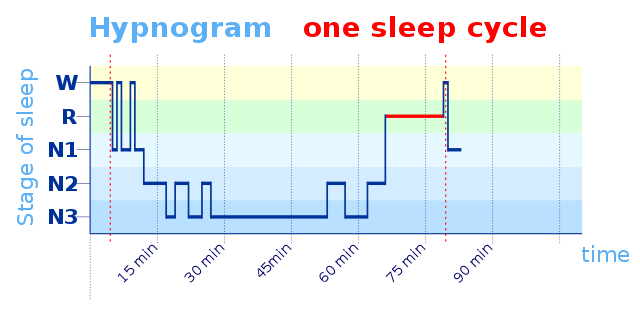

Recently I stumbled upon [a Reddit post](https://www.reddit.com/r/changemyview/comments/g4szax/cmv_it_should_be_the_standard_in_offices_to_allow/) in the [ChangeMyView](https://reddit.com/r/changemyview) subreddit that suggested that it should be "the standard" for employers to allow 20-minute naps around noon.

As someone that values having some downtime around lunch to close my eyes and nap, this topic was worth reviewing in detail. What are the benefits of taking naps? How long should naps actually be? When should they be taken? Can an employer allow an employee to take naps? Continue reading for answers.

## Essential Notes on Naps

The following essential notes on naps are backed up by a variety of different (seemingly) reputable sources that I've researched.

* **Keep naps to 20 minutes.**
  * If you're going to nap longer, make sure it's 30 minutes max, or 90 minutes minimum.
  * Napping for a range between the 30-90 minute suggestions will leave you [feeling dazed because you've reached deeper stages of sleep](https://www.sleep.org/articles/how-long-to-nap/) and then subsequently interrupted them prematurely.
  * If you're sleep deprived *(5 hours of sleep)*, the optimal amount of time to nap [may start from around 10 minutes](https://pubmed.ncbi.nlm.nih.gov/16796222/).
* **The time to nap after eating is an important factor**.
  * After eating, the body eventually enters a state called [_reactive hypoglycemia_](https://www.mayoclinic.org/diseases-conditions/diabetes/expert-answers/reactive-hypoglycemia/faq-20057778), which is a drop in blood sugar levels that occurs a few hours after eating.
  * Blood sugar levels increase when eating processed foods and sugars. Your body will feel desperately like it needs a nap when reaching this state, which typically is reached after about 2-4 hours after eating.
  * Reactive hypoglycemia can be counteracted by spreading out snacks throughout the day, and reducing sugars and processed foods. [Fruits contain sugars that are packaged with large amounts of fiber](https://www.livestrong.com/article/364550-why-does-my-blood-glucose-drop-after-eating/), so eating fruits is a great substitute for satisfying sweet cravings while reducing unhealthy sugar intake.
* **Don't nap later in the afternoon.**
  * Taking naps after 3pm [can actually interfere with regular scheduled sleep at night](https://www.healthline.com/health/how-long-should-i-nap#best-time-for-a-nap).
  * Later in this article, we present a table that shows when to properly take a nap based on when you wake up, need to be at work, need to go to bed, etc. This is useful for individuals with non-standard shifts.

## Sleep Stages & Cycles

Taking a brief, 20-minute nap allows the body to enter the first 1-3 stages of sleep, without entering *[SWS (Slow-wave sleep)](https://en.wikipedia.org/wiki/Slow-wave_sleep)*, which occurs a portion of the way through stage 3 and all of stage 4. This is an example of sleep stages during a 90-minute cycle:

Sleep cycles are a topic with going into at a later time, but the takeaway here is that *sleep inertia* builds after 20-50% through stage 3. The goal of a proper nap is to reduce the interruption of sleep inertia while still preserving the proper benefits.

## Benefits of a Midday Nap

Naps have been linked with the possibility of:

* **Increasing physical awareness**
  * Gaining increased [psychomotor speed](https://en.wikipedia.org/wiki/Mental_chronometry)
  * Better reaction time to all external stimuli
  * Generally increased sense of awareness and alertness
* **Enhanced learning**
  * [Improvements in focus and memory](https://onlinelibrary.wiley.com/doi/full/10.1111/ejn.12118)
  * The ability to learn and retain new information is enhanced after ending a nap
  * In infants, a [notable increase in efficiency for learning new words](https://onlinelibrary.wiley.com/doi/full/10.1111/jsr.12306)
* **Biochemistry and physical improvements**
  * [Lowered blood pressure](https://www.acc.org/about-acc/press-releases/2019/03/07/08/56/a-nap-a-day-keeps-high-blood-pressure-at-bay/ ), with changes on par with cutting salt and alcohol consumption from a diet
  * [Counteract jet lag via _"the NASA nap"_](https://web.archive.org/web/20120419073208/http://human-factors.arc.nasa.gov/zteam/fcp/pubs/jsr.art.html).

The ["NASA nap" article](https://web.archive.org/web/20120419073208/http://human-factors.arc.nasa.gov/zteam/fcp/pubs/jsr.art.html) (mentioned in the last bullet point above)  notes that naps of some longer lengths (such as 2, 3, or 4 hours) actually tend to blend together and deliver similar results - meaning that a 2-hour nap could be just as beneficial as a 4-hour nap.

The study also mentions that the "rest group" was assigned a 40-minute nap time, but the circumstances were engineered carefully to prevent subjects from entering *[SWS (Slow-wave sleep)](https://en.wikipedia.org/wiki/Slow-wave_sleep)*.

## Downsides of a Midday Nap

Napping requires a bit of foundational discipline. Ensure that your naps follow the advice sprinkled throughout this article.

* **Midday naps must never exceed 20 minutes**
  * Or else exiting the nap will feel as if a deep sleep has been interrupted.
* **Risk of interrupting circadian rhythm**
  * Sleeping at the wrong time of day or for too long can interrupt the circadian rhythm.
* **Habitually taking longer naps increases risk of cardiovascular disease and all-cause mortality**
  * Specifically, napping for longer than an hour during the day [is associated with generally being less healthy](https://www.ncbi.nlm.nih.gov/pmc/articles/PMC4667384/).
  * If you're finding yourself taking longer naps on a regular basis, evaluate your daily routine and seek ways to improve your routine. Use the table in this article below for an example of an optimal routine, and try to eat healthier and exercise for a few weeks until the rhythm changes.

## How Can Employers and Employees Pragmatically Integrate Nap Time?

Employers need to be able to understand _when_ naps are allowed, and employees should understand how to position their daily routine to work _within_ the allotted time for naps.

### Employers: Mandatory Break Time can be Nap Time

The [US Department of Labor](https://www.ecfr.gov/cgi-bin/text-idx?SID=e3f9c1811869ec345c438a13e9cdde93&mc=true&node=pt29.3.785&rgn=div5#se29.3.785_118) provides paid rest periods of short duration running from 5-20 minutes, and even notes that employee efficiency is improved when these periods are utilized.

The maximum allowable nap time under our guidelines is 20 minutes. Therefore, solely under these guidelines, a 20-minute nap is _already_ employer-sponsored.

However, the Department of Labor website does not appear to mention the _maximum_ number of break periods allowed. For this, I'll refer to [California law](https://www.shouselaw.com/employment/breaks.html#1), which states that a typical 8-hour shift entitles employees to 30 minutes of unpaid lunch and 20 minutes of paid rest time. If you intend to integrate napping into your break period, you may have to ensure that the 20-minute nap is within this legal boundary.

### Employees: When to Nap According to Shift Start Time

For an 8-hour workday, assuming a schedule of sleeping from 10pm-6am and working from 9am-5pm, and lunch at 12pm, the latest possible time for a nap might be around 7.5 hours before bedtime, which lands an ideal nap time at approximately 2:30pm. Ensure that your nap ends before 3pm for best results.

This table shows an ideal circadian schedule, including 8 hours of sleep, 16 hours awake, 8 hours work, and a proper midday nap:

| Wake Up  | Shift Start | Lunch    | Nap        | Shift End | Bed       |
| -------- | ----------- | -------- | ---------- | --------- | --------- |
| *Start*  | *+3 hrs*    | *+6 hrs* | *+8.5 hrs* | *+11 hrs* | *+16 hrs* |
| 12:00 AM | 3:00 AM     | 6:00 AM  | 8:30 AM    | 11:00 AM  | 4:00 PM   |
| 1:00 AM  | 4:00 AM     | 7:00 AM  | 9:30 AM    | 12:00 PM  | 5:00 PM   |
| 2:00 AM  | 5:00 AM     | 8:00 AM  | 10:30 AM   | 1:00 PM   | 6:00 PM   |
| 3:00 AM  | 6:00 AM     | 9:00 AM  | 11:30 AM   | 2:00 PM   | 7:00 PM   |
| 4:00 AM  | 7:00 AM     | 10:00 AM | 12:30 PM   | 3:00 PM   | 8:00 PM   |
| 5:00 AM  | 8:00 AM     | 11:00 AM | 1:30 PM    | 4:00 PM   | 9:00 PM   |
| 6:00 AM  | 9:00 AM     | 12:00 PM | 2:30 PM    | 5:00 PM   | 10:00 PM  |
| 7:00 AM  | 10:00 AM    | 1:00 PM  | 3:30 PM    | 6:00 PM   | 11:00 PM  |
| 8:00 AM  | 11:00 AM    | 2:00 PM  | 4:30 PM    | 7:00 PM   | 12:00 AM  |
| 9:00 AM  | 12:00 PM    | 3:00 PM  | 5:30 PM    | 8:00 PM   | 1:00 AM   |
| 10:00 AM | 1:00 PM     | 4:00 PM  | 6:30 PM    | 9:00 PM   | 2:00 AM   |
| 11:00 AM | 2:00 PM     | 5:00 PM  | 7:30 PM    | 10:00 PM  | 3:00 AM   |
| 12:00 PM | 3:00 PM     | 6:00 PM  | 8:30 PM    | 11:00 PM  | 4:00 AM   |
| 1:00 PM  | 4:00 PM     | 7:00 PM  | 9:30 PM    | 12:00 AM  | 5:00 AM   |
| 2:00 PM  | 5:00 PM     | 8:00 PM  | 10:30 PM   | 1:00 AM   | 6:00 AM   |
| 3:00 PM  | 6:00 PM     | 9:00 PM  | 11:30 PM   | 2:00 AM   | 7:00 AM   |
| 4:00 PM  | 7:00 PM     | 10:00 PM | 12:30 AM   | 3:00 AM   | 8:00 AM   |
| 5:00 PM  | 8:00 PM     | 11:00 PM | 1:30 AM    | 4:00 AM   | 9:00 AM   |
| 6:00 PM  | 9:00 PM     | 12:00 AM | 2:30 AM    | 5:00 AM   | 10:00 AM  |
| 7:00 PM  | 10:00 PM    | 1:00 AM  | 3:30 AM    | 6:00 AM   | 11:00 AM  |
| 8:00 PM  | 11:00 PM    | 2:00 AM  | 4:30 AM    | 7:00 AM   | 12:00 PM  |
| 9:00 PM  | 12:00 AM    | 3:00 AM  | 5:30 AM    | 8:00 AM   | 1:00 PM   |
| 10:00 PM | 1:00 AM     | 4:00 AM  | 6:30 AM    | 9:00 AM   | 2:00 PM   |
| 11:00 PM | 2:00 AM     | 5:00 AM  | 7:30 AM    | 10:00 AM  | 3:00 PM   |

## How to Nap at Work

In order to actually take a nap without going home during the day, your choices are limited:

* **Find a lounge room at work, some employers offer massage chairs**.
  * Put on your headphones and doze off, assuming you can't get in trouble for it.
* **Close your eyes while at your desk for a bit**.
  * This may be a fireable offense in some corporate cultures.
  * Chat with your colleagues and management about doing this first.
* **Nap in the car**.
  * Napping in your car at work on company property can be a fireable offense. Check first.
* **Drive to a nearby park and nap in your car**.
  * In Arizona, [laws are in place](https://www.acluaz.org/sites/default/files/field_documents/homeless_rights_in_phoenix.pdf) to prevent sleeping on public property, including parks. However, napping in the car is generally fine.
* **Nap using an approved space at work**.
  * It's unlikely that your employer has this but if they do, use it!

If your management chain is adamant about not allowing naps, don't push it. They clearly have their reasons (regardless of yours) and your reasons just aren't good enough. Try to be smart and respectful about this.

## Sleeping Less if You Nap

If you follow these guidelines and take effective midday naps, can you reduce how long you spend sleeping overall?

This question can lead us down the rabbit hole of [polyphasic sleep](https://en.wikipedia.org/wiki/Polyphasic_sleep), which is a topic for another day. For now, the answer to this question is: No, you should not change the amount of time you normally spend sleeping if you take a nap. Midday naps are meant to augment the circadian rhythm of a normal 7-8 hour sleep duration, not replace lost sleep time.

_However_, with that being said... a well-executed nap can [reverse the hormonal impact of not getting a good night's sleep](https://www.sciencealert.com/napping-may-be-able-to-reverse-the-damage-of-sleep-deprivation). Just don't do it regularly - the evidence provided throughout this article does not support the notion that it's OK to reduce longer sleep cycles in favor of naps.

## Summary

Taking a midday nap of 10-20 minutes approximately 2.5 hours after substantial food intake *(such as lunch)*  can yield measurable neurological, biochemical, and physical changes in the body.

If proper napping guidance is not followed, circadian rhythm can be interrupted, leading to an inverse result.

Those who are seeking to optimally nap during their workday already legally can do so, but must find a reasonable place to do it without committing fireable offenses, such as in their car at a park.

Finally, there is evidence showing that a nap can help reduce the impact of getting a poor night's sleep on occasion, but the discussion of utilizing naps to _replace_ a typical 7-9-hour sleep schedule is protracted for another occasion.

## Other Articles

The following links are suggested for your reading, _in addition to_ the ones directly linked in the article itself.

* [Mayo Clinic: Napping: Do's and don'ts for healthy adults](https://www.mayoclinic.org/healthy-lifestyle/adult-health/in-depth/napping/art-20048319)
* [Sleep.org: Sleeping During the Day](https://www.sleep.org/articles/sleeping-during-the-day/)
* [WikiHow: How to sleep at work](https://www.wikihow.com/Sleep-at-Work)
* [Wikipedia: Power Nap](https://en.wikipedia.org/wiki/Power_nap)
