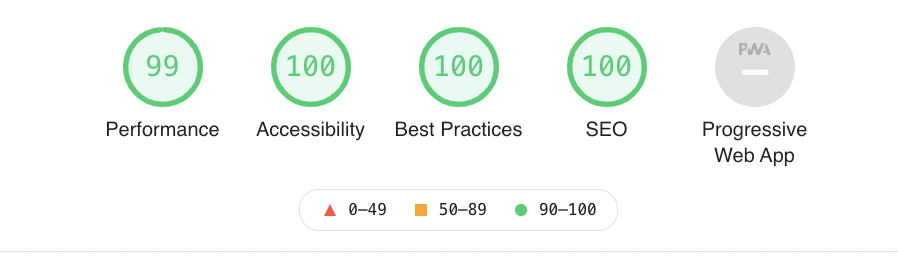

A booming, Etsy-based online retailer called BananAppeal.co was in need of a landing page, and I wanted to help them out. So, in less than one day, I assembled a simple (but very sleek) landing page for their business.

You can view the page here: [bananappeal.co](https://bananappeal.co)

## Video


<video controls width="100%" style="max-height: 600px">
    <source src="images/bananappeal-mobile.mov"
            type="video/mp4">
    Sorry, your browser doesn't support embedded videos.
</video>



## Performance/Accessibility/Best Practices/SEO

Using [Lighthouse](https://web.dev), the website meets almost 100% across every web-based metric:



The only metric it falls behind on is the recommendation to serve next-gen images instead of the more universally compatible jpg/png images. I opted not to go through that exercise for this project.

## Attributions

* [Pink notebook](https://unsplash.com/photos/lFmuWU0tv4M)
* [Figurines](https://unsplash.com/photos/vCYfdVhIZ2Y)
* [iPhone near mac](https://unsplash.com/photos/xsGxhtAsfSA)
* [FontAwesome](https://github.com/FortAwesome/Font-Awesome)
* [Bootstrap](https://getbootstrap.com/)
* [AOS](https://github.com/michalsnik/aos)

## Technical discussion

The site is very simple; despite this portfolio item being categorized as "full stack", this is purely frontend, uses *almost* no JavaScript whatsoever. I am leveraging the latest Bootstrap 5 for the layout and components.

### Animations

The [AOS](https://github.com/michalsnik/aos) library really makes a difference, though. The animations are extremely easy to implement:

```html
<div class="col-12" data-aos-offset="0" data-aos-delay="25" data-aos-duration="1000" data-aos="fade-up">
</div>
```

It should be fairly obvious that aos.js simply looks at every element in the document, and applies a standard set of CSS animations based on the value of `data-xyz` values. In HTML, anything with `data-` is intended to be used as an arbitrary data store, which is quite powerful, and allows for a lot of awesome libraries to shine (with minimal effort) like aos.js.

By mixing up the offsets and delays, I was able to create a very polished-looking set of scrolling animations, which can be seen as you scroll down the website.

### Biggest challenge

The biggest challenge was that the awesome parallax effect is actually disabled on iOS (and probably Android) devices due to the fact that it (apparently) uses a lot of resources to render. When developing the site on a regular computer, it looks amazing - parallax included - but, on the mobile device, the background's color is the only thing we see. This was a bit of a bummer.

A lot of posts on StackOverflow throw some hack-ish solutions for this, but I always opt to go for the simplest and most robust solution. In this case, using CSS media queries to simply render the main logo without parallax on mobile devices, and with parallax on other devices. Here's how to do it:

```css
/* gets applied first, and allows parallax to work on all regular devices */
.bg-bananappeal {
  background-image: url('images/bananappeal.co.svg');
  background-size: contain;
  background-repeat: no-repeat;
  background-color: #FFDE59;
  background-attachment: fixed;
  background-position: center;
}

/* gets applied first, and hides the logo on all regular devices*/
.logo-mobile-only {
  display: none;
}

/* only on mobile will the parallax effect be unset: */
/* https://stackoverflow.com/a/47517612 */
@media (pointer: coarse) {
  .bg-bananappeal {
    background-image: unset !important;
    background-size: unset !important;
    background-repeat: unset !important;
    background-attachment: unset !important;
    background-position: unset !important;
  }
  /* only on mobile will the logo be actually visible: */
  .logo-mobile-only {
    display: block;
  }
}
```

### Efficiency/Optimizations

In general, the footprint of this project is fairly small. I didn't want to minify or compress anything since I can generally rely on Cloudflare's proxy to do caching and minifying. **Work smarter, not harder** - if there was actually a scenario where I had to minify and compress, I would do it.

### Source Code

You can view the source code [here](https://github.com/charles-m-knox/bananappeal.co) on GitHub.

## Where the results of this project went

[BananAppeal.co](https://bananappeal.co) is gaining traction, and I'm happy to have been a part of their journey. Best of luck!
