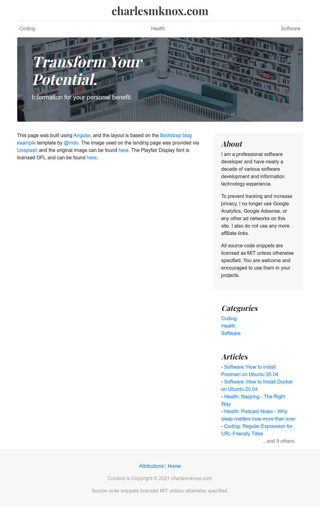
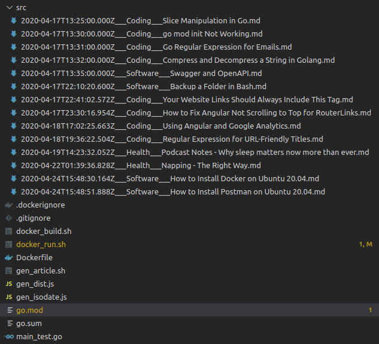

Before switching to [Hugo](https://gohugo.io), I wrote my own full-stack website, and hosted it on AWS. The site was written in:

* **Frontend**: Angular 9
* **Middleware**/web server: Go 1.13
* **Data**: Static markdown files

## Screenshots

Because the website is not statically generated and requires a live API, and I do not want to continue to provide uptime for the API, I'll be providing a few screen captures of the site in action.

**For some of the below screenshots, click on it to view a larger version.** Images are compressed significantly in order to avoid any strain on my hosting providers. I would have exported them statically and render them here, but it's a messy process and will bloat this site's footprint more due to the fact that each static export would have included all of the CSS, webfonts, and images _for each screenshot_.

### Attributions

[](images/sc-charlesmknox-blog_attributions_long.jpg)

### Articles Listing

*Click the image for a larger version that isn't cut off.*

[](images/sc-charlesmknox-blog_all-articles_long.jpg)

### An Article

*Click the image for a larger version (of a different article, on sleeping) that isn't cut off. This one is quite long.*

[](images/sc-charlesmknox-blog_napping-article_long.jpg)

## Technical Discussion

The site's API layer was written in [Go 1.13](https://golang.org), was served via [Docker](https://docker.com) and used a no-DB architecture that focused purely on storing files in a `./src` directory:



It's pretty clear that the articles have a specific naming convention. In order to quickly generate an article, I created a bash script called `./gen_article.sh`:

```bash
#!/bin/bash -e

pubdate=$(./gen_isodate.js)

read -p "Publication title: " pubtitle
read -p "Publication category: " pubcategory

echo "# ${pubtitle}" > "./src/${pubdate}___${pubcategory}___${pubtitle}.md"

echo "Done!"
```

Note that `./gen_isodate.js` does nothing more than this:

```bash
#!/usr/bin/env node
console.log(new Date().toISOString());
```

I probably could have just replaced it with the following Bash command though, instead of bringing Node into the mix - but after a certain point it was just easier to leave it, since Node was already a dependency in this project anyways:

```bash
date -u +"%Y-%m-%dT%H:%M:%SZ"
```

> Side note: Normally I'm very strict about what dependencies I use. I always opt for the bare minimum of what's needed in order to get the job done. This was honestly just me being lazy, which was OK, because it was only me working on this project :smile:

### Efficiency/Optimizations

I didn't specifically focus on optimizing the frontend, but I did get to leverage industry-standard optimizations in the middleware layer.

The footprint of the site's API is as follows:

* **Docker image size**: 13.4 MB
* **CPU Usage**: <1% normally, with un-noticeable CPU consumption when reading from disk (no time to run more detailed benchmarks; not really worth it)
* **Runtime memory usage**: 6.5MiB, serving 14 documents from memory

The footprint of the frontend is as follows:

* **Build time**: On a 10th-gen Intel i7, build time (via `ng build --prod`) is 26306ms
* **Site size**: 1.5MB, including all CSS; excludes web fonts and images loaded externally

### API Dockerfile

The following builder pattern works very well for creating a minimal image and binary (13.4MB mentioned above).

```Dockerfile
FROM golang:alpine AS builder

WORKDIR /go/src/current
COPY go.mod /go/src/current

RUN go mod download

COPY . /go/src/current

WORKDIR /go/src/current
RUN go build -v

FROM alpine:latest

COPY --from=builder /go/src/current/content /content

CMD ["/content"]
```

### Source Code

I don't feel it's appropriate to release the source code to the public on this project. I'm definitely a huge open source software enthusiast and advocate, but in this case, my reasons for not wanting to publish are:

* It's very unpolished; there's a lot of "tinker" code that I ended up just commenting out. It's not worth the time to clean it up.
* All of the code/functionality in the API that actually matters was fed into the [Light Sites](https://gitlab.com/light-sites/light-sites) project, mentioned below.
* Due to how fast Go and Angular iterate their frameworks, I felt that releasing older, unpolished, random code to the the open source community might do more harm than good - I imagine someone stumbling upon this codebase and naively viewing some of it as "best practice".

As with any software project, informal or not, careful decisions need to be made when it comes to deciding when to release.

### How the API reads & serves data

When designing the API, I wanted to take an approach that might prevent excessive disk reads, in the event that someone nefarious ever tried spamming requests to my API. To handle this, I opted to read every `.md` file under `./src` and load it into memory every 30 minutes. Then, when someone makes a request to my API for the content they asked for, I'd be serving it from RAM instead of doing any disk IO.

If I've got 14 files and I read from disk every 30 minutes, you could say that it's equivalent to someone hitting the page approximately every 2 minutes, in terms of the number of files read from disk. My blog was never popular enough to justify that, but it seemed like a solid approach to getting the most out of that already-minimalist RAM footprint of about 6.5MiB (mentioned in the [efficiency/optimizations](#efficiencyoptimizations) section above).

In essence, this was a pure-RAM-cache API that served its purpose fairly well. There's always room for optimizations and improvements in any software that we write, but this was "good enough".

For larger-scale websites, the API footprint would have grown, and the average number of disk-reads per minute would go up, but all things considered it's still a reasonable approach.

A better approach would be not to use intervals at all. Instead, do a "read-once" whenever an API request comes in for any article that hasn't been retrieved in the last e.g. 2 hours, then cache the contents of that page in memory. Many caching layers in production-grade software do some variant of this.

### Downsides

The biggest downside with writing a website with an always-on API is ensuring uptime. Even with Docker's `--restart unless-stopped` option, managing an AWS VM just to keep the API alive isn't worth it. For this kind of website, statically generated files are by far better, because I can just generate the files and upload the site to GitHub Pages, AWS S3, etc. and spend zero energy and time managing it beyond that. Reusing other services to save yourself time is almost always the way to go.

## Where the results of this project went

After writing this, I took a lot of the learnings from statically parsing Markdown files, traversing HTML node trees, and API layers to write [Light Sites](https://gitlab.com/light-sites/light-sites). This was another fun project that was a successor to this API; it was unit tested more comprehensively (>95% coverage), has more customizability, and had more focused time investment. Since [Light Sites](https://gitlab.com/light-sites/light-sites) was primarily a portfolio builder project, I plan to do a writeup on it here as well.

Additionally, some of the techniques I used and implemented in the Angular frontend have stuck with me for years and have been very useful. Personal projects always yield valuable learning.

Thanks for reading!

