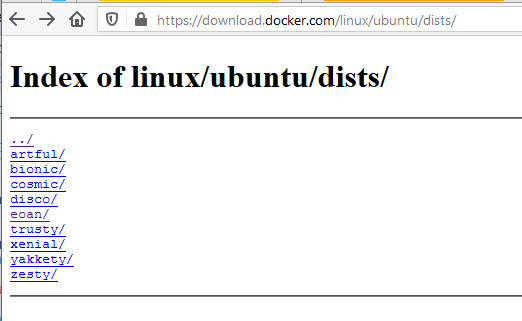



It's April 24, 2020. Ubuntu 20.04 _just_ came out. Installing Docker via the method I typically use via [get.docker.com](https://get.docker.com) does not seem to work. Additionally, the [Docker website](https://docs.docker.com/engine/install/ubuntu/) doesn't seem to have install instructions for Ubuntu 20.04 yet. [Snap](https://snapcraft.io/) installations are recommended by Canonical, but from past experience with the Docker Snap, I prefer to stick to a native method of installation.

*If you don't have Ubuntu 20.04 yet, it was released on April 23, 2020. [Go get it here](https://ubuntu.com/download)!*

In Ubuntu 20.04, the `apt` package `docker.io` should do the trick. Continue reading for a step-by-step breakdown.

## Installation

Install the package:

```bash
sudo apt install docker.io
```

Enable the [systemd](https://www.freedesktop.org/software/systemd/man/systemd.service.html) service for Docker:

```bash
sudo systemctl enable --now docker
```

Ensure your user is a member of the `docker` group so that you don't have to use `sudo` to run Docker commands:

```bash
sudo usermod -aG docker $USER
```

*Unfortunately, you do have to log out of your current session in order for the new `docker` group membership to propagate to future Bash terminal sessions. The rest of the Docker commands in this guide will include `sudo` to make it a little easier for you, in case you choose not to log out.*

## Confirm it works

Then, try running [Nginx](https://hub.docker.com/_/nginx/) locally:

```bash
sudo docker run --rm -it -p 8080:80 nginx:alpine
```

Visit http://localhost:8080 in your browser and verify that it works!


Quit out of the currently running Nginx container by pressing `CTRL+C`. This will also clean it up, thanks to the `--rm` flag we passed into the `docker run` command.

## Install Docker compose

Next, install Docker compose by retrieving the `docker-compose` release binary from GitHub - these steps _are_ on the [Docker website](https://docs.docker.com/compose/install/#install-compose-on-linux-systems):

```bash
sudo curl -L "https://github.com/docker/compose/releases/download/1.25.5/docker-compose-$(uname -s)-$(uname -m)" -o /usr/local/bin/docker-compose
```

> Note that this may be out of date; please use the instructions from the release to install Docker compose. This is just an example.

Add executable permissions to the binary:

```bash
sudo chmod +x /usr/local/bin/docker-compose
```

Verify by running:

```bash
sudo docker-compose version
```



## `apt update` broken - fix

As of 5/15/2020, Docker has released a formal `focal` release. Previously, there were only `eoan` packages available, which caused `sudo apt update` to break, and required extra steps to fix it, outlined in the collapsed section below. In order to verify a successful Docker installation, update your package index now:

```bash
sudo apt update
```

This should succeed with no issues. If for some reason there are still issues, consider expanding & reviewing the content in the **Fixing Apt Failures** section below.

<details>
  <summary><i>(Outdated)</i> <b>Fixing Apt Failures</b></summary>

There's one caveat to this installation method currently. There is currently no apt repository source for Ubuntu 20.04, seen here:



This will cause `sudo apt update` commands to fail:

```
Get:1 http://us.archive.ubuntu.com/ubuntu focal InRelease [265 kB]
Ign:2 https://download.docker.com/linux/ubuntu focal InRelease
Err:3 https://download.docker.com/linux/ubuntu focal Release
  404  Not Found [IP: 13.33.71.38 443]
Hit:5 http://security.ubuntu.com/ubuntu focal-security InRelease
Get:6 http://us.archive.ubuntu.com/ubuntu focal-updates InRelease [89.1 kB]
Hit:7 http://us.archive.ubuntu.com/ubuntu focal-backports InRelease
Get:8 http://us.archive.ubuntu.com/ubuntu focal-updates/main amd64 Packages [1,760 B]
Reading package lists... Done
E: The repository 'https://download.docker.com/linux/ubuntu focal Release' does not have a Release file.
N: Updating from such a repository can't be done securely, and is therefore disabled by default.
N: See apt-secure(8) manpage for repository creation and user configuration details.
```

To fix this, edit the file `/etc/apt/sources.list.d/docker.list` to include an `eoan` release:

```
# original preserved:
#deb [arch=amd64] https://download.docker.com/linux/ubuntu focal stable
deb [arch=amd64] https://download.docker.com/linux/ubuntu eoan stable
```

Then, run:

```bash
sudo apt update
```

</details>

## Done

All set! You should now be able to run Docker containers, as well as orchestrate services with Docker compose files.


