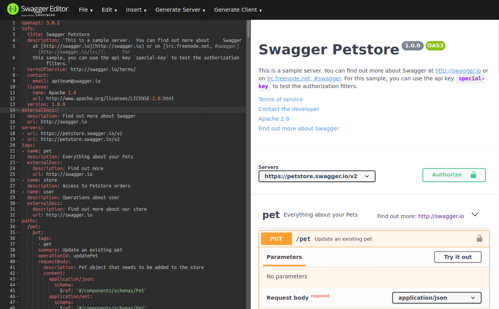



Swagger is a framework to enable arbitrary implementations of the OpenAPI specification.

## Why?

In all of the projects I've worked on (personal and professional), one of the more consistent problems is documentation of API endpoints, as well as agreement upon REST interaction schema between microservices. It wasn't until a few years into my software development career that I became aware of Swagger.

Swagger lets you:

* auto-generate interactive documentation for your REST API
* auto-generate a client to consume your defined REST API in many programming languages/frameworks
* auto-generate a server to host your defined REST API in many programming languages/frameworks

For the bright software developer that wishes to move fast but still produce quality software, Swagger is an optimal choice for delivering results.

## Preview of the Swagger UI

Take a look for yourself:



## Getting Started

Clone the Swagger repository:

```bash
git clone https://github.com/swagger-api/swagger-editor.git
```

Run it locally by running the following command - this may take a while:

```bash
npm start
```

Navigate to http://localhost:3001 in your browser.

*I personally always recommend using the Docker deployment methods where possible. Initially, I chose not to use Docker and instead went with native Node because I was worried about mounting files between the Swagger container and my host. However, after using it, I found that I do not use Swagger for writing files, I just copy/paste between my browser. So, feel free to just run the Dockerized version.*

## Start Minimal

The Swagger editor comes with a fully populated example. Sift through each of the items to build out a desirable schema for your needs.

```yaml
openapi: 3.0.1
info:
  title: Article Server
  description: 'Article server'
  version: 1.0.0
servers:
  - url: http://localhost:8080/api
  - url: https://charlesmknox.com/api/articles
paths:
  /articles: TBD
components:
  schemas:
    Article: TBD
    Articles: TBD
```

This article will be covering the `TBD` sections above.

## Create the Article JSON Object

Using [Swagger Toolbox](https://swagger-toolbox.firebaseapp.com/), a basic JSON structure can immediately be converted to a Swagger schema definition.

Here's the basic structure for an `Article` data type:

```json
{
    "title": "An Article",
    "articleID": "9e4c8443-c89f-4c1d-8b03-fb25e327780c",
    "date": "2020-04-15T15:38:10.243Z",
    "authorID": "5af053ca-1bfe-46ed-8578-f6f420a44bb0",
    "markdown": "Here's some `markdown content`.",
    "renderedMarkdown": "",
    "categoryIDs": [
        "d6d04c55-3645-49f3-a512-818f5fc127ff"
    ]
}
```

*Ensure there are no syntax errors in the input JSON. The error messages from the toolbox may not directly indicate that there are syntax errors.*

Here is the output yaml content:

```yaml
---
  required:
    - "title"
    - "articleID"
    - "date"
    - "authorID"
    - "markdown"
    - "renderedMarkdown"
    - "categoryIDs"
  properties:
    title:
      type: "string"
    articleID:
      type: "string"
    date:
      type: "string"
    authorID:
      type: "string"
    markdown:
      type: "string"
    renderedMarkdown:
      type: "string"
    categoryIDs:
      type: "array"
      items:
        type: "string"
```

*Note: Part of yaml syntax includes `---` as a header. This will be removed when adding this schema to the final Swagger yaml document.*

## Improving the Article Schema

In order to get a more effective schema defined, constraints can be applied to some data types, such as the one associated with the `date` field.

*For comprehensive reference, please refer to the Swagger docs: https://swagger.io/docs/specification/data-models*

*For the OpenAPI specification on data types, visit this page: https://swagger.io/specification/#dataTypes*

In particular, update the `date` property from this:

```yaml
    date:
      type: "string"
```

To this:

```yaml
    date:
      type: "string"
      format: "date-time"
```

The `date-time` format will expect values to follow the ISO8601 standard date format - example: `2020-04-15T15:38:10.243Z`.

The result is now:

```yaml
---
  required:
    - "title"
    - "articleID"
    - "date"
    - "authorID"
    - "markdown"
    - "renderedMarkdown"
    - "categoryIDs"
  properties:
    title:
      type: "string"
    articleID:
      type: "string"
    date:
      type: "string"
      format: "date-time"
    authorID:
      type: "string"
    markdown:
      type: "string"
    renderedMarkdown:
      type: "string"
    categoryIDs:
      type: "array"
      items:
        type: "string"
```



## Completing the Article Schema

The things done up to this point still have not actually completed the full schema definition, only the data structure within the schema. In order to complete the schema, tack-on a few values surrounding the structure from above:

```yaml
Article:
  type: object
  required:
    - "title"
    - "articleID"
    - "date"
    - "authorID"
    - "markdown"
    - "renderedMarkdown"
    - "categoryIDs"
  properties:
    title:
      type: "string"
    articleID:
      type: "string"
    date:
      type: "string"
      format: "date-time"
    authorID:
      type: "string"
    markdown:
      type: "string"
    renderedMarkdown:
      type: "string"
    categoryIDs:
      type: "array"
      items:
        type: "string"
```

The `components` section of the Swagger yaml document should be modified to include this now:

```yaml
components:
  schemas:
    Article:
      type: object
      required:
        - "title"
        - "articleID"
        - "date"
        - "authorID"
        - "markdown"
        - "renderedMarkdown"
        - "categoryIDs"
      properties:
        title:
          type: "string"
        articleID:
          type: "string"
        date:
          type: "string"
          format: "date-time"
        authorID:
          type: "string"
        markdown:
          type: "string"
        renderedMarkdown:
          type: "string"
        categoryIDs:
          type: "array"
          items:
            type: "string"
```

## Create an Array of Articles

Now that an `Article` schema has been defined, it will become necessary to return an array of `Article` objects as part of a typical API response. To do this, Swagger offers the `$ref` keyword, which points to any item in the Swagger yml document that's been defined elsewhere. This feature will be used to set up a new `Articles` schema to simply be an array of `Article` objects.

*For documentation on the `$ref` keyword, visit this page: https://swagger.io/docs/specification/using-ref/*

Here is an example of the new `Articles` schema:

```yaml
Articles:
  type: array
  items:
    $ref: '#/components/schemas/Article'
```

Add this to the `components` section in the Swagger yaml file:

```yaml
components:
  schemas:
    Article:
      type: object
      required:
        - "title"
        - "articleID"
        - "date"
        - "authorID"
        - "markdown"
        - "renderedMarkdown"
        - "categoryIDs"
      properties:
        title:
          type: "string"
        articleID:
          type: "string"
        date:
          type: "string"
          format: "date-time"
        authorID:
          type: "string"
        markdown:
          type: "string"
        renderedMarkdown:
          type: "string"
        categoryIDs:
          type: "array"
          items:
            type: "string"
    Articles:
      type: array
      items:
        $ref: '#/components/schemas/Article'
```

## Create Articles REST API Endpoint

Now that the schema has been properly defined, the next step is to create a REST API endpoint to return `Articles` objects.

In the `paths` section of the Swagger yaml file, a new endpoint will be created. This section is easy, since the schemas have been created already:

```yaml
paths:
  /articles:
    get:
      summary: Retrieve all articles
      responses:
        200:
          description: successful operation
          content:
            application/json:
              schema:
                type: array
                items:
                  $ref: '#/components/schemas/Articles'
```

In this API endpoint definition, it's clear that only HTTP `200 OK` responses are expected and supported. Endpoint definitions can include other HTTP status code responses, such as `400 Bad Request`, `500 Internal Server Error`, etc.

## The Final Swagger Document

The final document will look like this now:

```yaml
openapi: 3.0.1
info:
  title: Article Server
  description: 'Article server'
  version: 1.0.0
servers:
- url: http://localhost:8080/api
- url: https://charlesmknox.com/blog/api
paths:
  /articles:
    get:
      summary: Retrieve all articles
      responses:
        200:
          description: successful operation
          content:
            application/json:
              schema:
                type: array
                items:
                  $ref: '#/components/schemas/Articles'
components:
  schemas:
    Article:
      type: object
      required:
        - "title"
        - "articleID"
        - "date"
        - "authorID"
        - "markdown"
        - "renderedMarkdown"
        - "categoryIDs"
      properties:
        title:
          type: "string"
        articleID:
          type: "string"
        date:
          type: "string"
          format: "date-time"
        authorID:
          type: "string"
        markdown:
          type: "string"
        renderedMarkdown:
          type: "string"
        categoryIDs:
          type: "array"
          items:
            type: "string"
    Articles:
      type: array
      items:
        $ref: '#/components/schemas/Article'
```



## Generate Server & Documentation

Click "Generate Server" at the top and choose a server to run, such as `go-server` or `nodejs-server`. Since the beginning of this guide uses Node, the `nodejs-server` will be chosen.

*When running the server, documentation is hosted at http:/localhost:8080/docs.*

Click `nodejs-server`. The browser will download a zip archive containing source code. Extract the files into a directory, example Bash steps:

```bash
mkdir swagger-node-article-server && \
mv nodejs-server-server-generated.zip swagger-node-article-server && \
cd swagger-node-article-server && \
unzip nodejs-server-server-generated.zip
```

The directory looks like this:

```
ls -alht
total 84K
-rw-r--r--   1 chuck chuck  698 Apr 15  2020 index.js
-rw-r--r--   1 chuck chuck  570 Apr 15  2020 README.md
-rw-r--r--   1 chuck chuck 1.1K Apr 15  2020 .swagger-codegen-ignore
drwxr-xr-x   8 chuck chuck 4.0K Apr 15 10:42 .
-rw-r--r--   1 chuck chuck  32K Apr 15 10:42 package-lock.json
-rw-r--r--   1 chuck chuck  372 Apr 15 10:42 package.json
drwxr-xr-x 101 chuck chuck 4.0K Apr 15 10:42 node_modules
drwxr-xr-x   2 chuck chuck 4.0K Apr 15 10:41 api
drwxr-xr-x   2 chuck chuck 4.0K Apr 15 10:41 controllers
drwxr-xr-x   2 chuck chuck 4.0K Apr 15 10:41 service
drwxr-xr-x   2 chuck chuck 4.0K Apr 15 10:41 .swagger-codegen
drwxr-xr-x   2 chuck chuck 4.0K Apr 15 10:41 utils
drwxr-xr-x  14 chuck chuck 4.0K Apr 15 10:41 ..
-rw-rw-r--   1 chuck chuck 3.9K Apr 15 10:38 nodejs-server-server-generated.zip
```

Run `npm install`:

```bash
npm install
```

Run `npm start`:

```bash
npm start
```

This will start the server on http://localhost:8080/ - leave this running in the background.

## Generate a Client to Consume the Server

Return to the original Swagger editor page (at http://localhost:3001) and click "Generate Client". In that menu, click "html2", and in a manner similar to the "Generate Server" functionality, a zip file will be downloaded. Proceed to extract the files from the zip file like before:

```bash
mkdir swagger-node-article-client && \
mv html2-client-generated.zip swagger-node-article-client && \
cd swagger-node-article-client && \
unzip html2-client-generated.zip
```

Open the `index.html` in your browser:

```bash
firefox index.html
```

Play around with the web page and observe that it provides documentation and instructions on how to consume the API using various clients.

## Related Content

* https://openapi.tools/ - a website containing a list of tools related to OpenAPI documents.



## Summary

In this article, the process of using the OpenAPI specification and Swagger to create an API with data structures, documentation, client, and server code has been demonstrated.

In your future software development projects, consider _starting_ with Swagger, and maintaining your Swagger yaml document(s) throughout the lifecycle of your project.

Stay healthy!

Chuck


